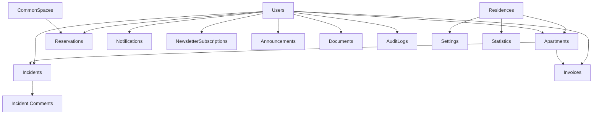

# 📊 Schéma de Base de Données Firestore - Mobilart Gestion

## 🏗️ Architecture Générale

La base de données est structurée en collections principales et sous-collections pour optimiser les performances et la scalabilité.

## 📁 Collections Principales

### 1. `residences`
Collection racine pour la configuration de la résidence.

```typescript
{
  id: "mobilart-oran",
  name: "Résidence Mobilart",
  address: "Boulevard Front de Mer",
  city: "Oran",
  country: "Algérie",
  postalCode: "31000",
  towers: ["A", "B", "C", "D"],
  floorsPerTower: 30,
  apartmentsPerFloor: 8,
  totalApartments: 960,
  amenities: [
    "Piscine",
    "Salle de sport",
    "Salle polyvalente",
    "Parking souterrain",
    "Espaces verts",
    "Aire de jeux",
    "Sécurité 24/7"
  ],
  contactEmail: "contact@mobilart-gestion.com",
  contactPhone: "+213 41 XX XX XX",
  logo: "https://storage.../logo.png",
  coverImage: "https://storage.../cover.jpg",
  createdAt: Timestamp,
  updatedAt: Timestamp
}
```

**Indexes:**
- Aucun index spécifique nécessaire (document unique)

### 2. `users`
Tous les utilisateurs du système.

```typescript
{
  id: "uid-firebase",
  email: "jean.dupont@email.com",
  firstName: "Jean",
  lastName: "Dupont",
  phone: "+213 555 XX XX XX",
  role: "resident", // super_admin | syndic | gardien | technicien | resident | comptable
  apartments: ["apt-a-15-03", "apt-b-20-05"], // IDs des appartements
  avatar: "https://storage.../avatar.jpg",
  isActive: true,
  emailVerified: true,
  phoneVerified: false,
  notificationPreferences: {
    email: true,
    sms: false,
    push: true
  },
  newsletterSubscribed: true,
  createdAt: Timestamp,
  updatedAt: Timestamp,
  lastLoginAt: Timestamp
}
```

**Indexes:**
- `role` (ASC) + `isActive` (ASC)
- `email` (ASC)
- `apartments` (ARRAY_CONTAINS) + `role` (ASC)
- `createdAt` (DESC)

### 3. `apartments`
Tous les appartements de la résidence.

```typescript
{
  id: "apt-a-15-03",
  residenceId: "mobilart-oran",
  tower: "A",
  floor: 15,
  number: "A-15-03",
  surface: 120, // m²
  rooms: 3,
  bathrooms: 2,
  balconies: 1,
  parkingSpots: 2,
  ownerIds: ["user-id-1"],
  residentIds: ["user-id-1", "user-id-2"],
  isOccupied: true,
  occupancyType: "owner", // owner | tenant | vacant
  monthlyCharges: 15000, // DZD
  notes: "Vue sur mer",
  createdAt: Timestamp,
  updatedAt: Timestamp
}
```

**Indexes:**
- `tower` (ASC) + `floor` (ASC)
- `isOccupied` (ASC) + `tower` (ASC)
- `ownerIds` (ARRAY_CONTAINS)
- `residentIds` (ARRAY_CONTAINS)
- `occupancyType` (ASC)

### 4. `incidents`
Tous les incidents déclarés.

```typescript
{
  id: "inc-2024-001",
  residenceId: "mobilart-oran",
  reporterId: "user-id",
  reporterName: "Jean Dupont",
  apartmentId: "apt-a-15-03",
  tower: "A",
  floor: 15,
  location: "Salle de bain principale",
  category: "plomberie", // plomberie | electricite | ascenseur | securite | nettoyage | espaces_verts | parking | autre
  priority: "haute", // urgente | haute | moyenne | basse
  status: "en_cours", // nouveau | en_cours | en_attente | resolu | ferme | annule
  title: "Fuite d'eau importante",
  description: "Fuite au niveau du lavabo...",
  images: ["https://storage.../img1.jpg"],
  assignedToId: "tech-user-id",
  assignedToName: "Ahmed Technicien",
  resolution: "Remplacement du joint...",
  resolvedAt: Timestamp,
  estimatedResolutionDate: Timestamp,
  createdAt: Timestamp,
  updatedAt: Timestamp
}
```

**Sous-collection: `comments`**
```typescript
{
  id: "comment-id",
  incidentId: "inc-2024-001",
  authorId: "user-id",
  authorName: "Ahmed Technicien",
  authorRole: "technicien",
  content: "Intervention programmée pour demain",
  images: ["https://storage.../progress.jpg"],
  isInternal: false,
  createdAt: Timestamp
}
```

**Indexes:**
- `status` (ASC) + `priority` (DESC) + `createdAt` (DESC)
- `reporterId` (ASC) + `status` (ASC)
- `assignedToId` (ASC) + `status` (ASC)
- `tower` (ASC) + `status` (ASC)
- `category` (ASC) + `status` (ASC)
- `createdAt` (DESC)

### 5. `invoices`
Factures et charges.

```typescript
{
  id: "inv-2024-01-001",
  residenceId: "mobilart-oran",
  apartmentId: "apt-a-15-03",
  userId: "user-id",
  invoiceNumber: "FAC-2024-01-001",
  type: "charges_mensuelles", // charges_mensuelles | charges_exceptionnelles | travaux | penalite | autre
  status: "envoyee", // brouillon | envoyee | payee | en_retard | annulee
  amount: 15000,
  vatAmount: 2850,
  totalAmount: 17850,
  dueDate: Timestamp,
  paidAt: Timestamp,
  paymentMethod: "virement",
  description: "Charges mensuelles Janvier 2024",
  items: [
    {
      description: "Charges communes",
      quantity: 1,
      unitPrice: 10000,
      totalPrice: 10000
    },
    {
      description: "Eau",
      quantity: 1,
      unitPrice: 3000,
      totalPrice: 3000
    },
    {
      description: "Entretien ascenseur",
      quantity: 1,
      unitPrice: 2000,
      totalPrice: 2000
    }
  ],
  documentUrl: "https://storage.../invoice.pdf",
  remindersSent: 0,
  lastReminderAt: Timestamp,
  notes: "",
  createdAt: Timestamp,
  updatedAt: Timestamp
}
```

**Indexes:**
- `userId` (ASC) + `status` (ASC) + `dueDate` (DESC)
- `apartmentId` (ASC) + `status` (ASC)
- `status` (ASC) + `dueDate` (ASC)
- `type` (ASC) + `status` (ASC)
- `createdAt` (DESC)

### 6. `announcements`
Annonces et communications.

```typescript
{
  id: "ann-2024-001",
  residenceId: "mobilart-oran",
  authorId: "admin-id",
  authorName: "Syndic Mobilart",
  title: "Coupure d'eau programmée",
  content: "Une coupure d'eau est prévue le...",
  category: "maintenance", // general | maintenance | security | event | urgent
  priority: "high", // low | medium | high | urgent
  targetAudience: {
    allResidents: false,
    towers: ["A", "B"],
    floors: [10, 11, 12],
    apartmentIds: []
  },
  images: ["https://storage.../announcement.jpg"],
  attachments: ["https://storage.../planning.pdf"],
  isPublished: true,
  publishedAt: Timestamp,
  expiresAt: Timestamp,
  viewCount: 245,
  createdAt: Timestamp,
  updatedAt: Timestamp
}
```

**Indexes:**
- `isPublished` (ASC) + `priority` (DESC) + `publishedAt` (DESC)
- `category` (ASC) + `isPublished` (ASC)
- `expiresAt` (ASC) where `isPublished` = true
- `createdAt` (DESC)

### 7. `documents`
Documents officiels et fichiers.

```typescript
{
  id: "doc-2024-001",
  residenceId: "mobilart-oran",
  uploadedById: "admin-id",
  uploadedByName: "Syndic Mobilart",
  title: "Règlement intérieur 2024",
  description: "Version mise à jour du règlement",
  category: "reglement", // reglement | pv_ag | contrat | plan | facture | attestation | autre
  fileUrl: "https://storage.../reglement.pdf",
  fileName: "reglement_interieur_2024.pdf",
  fileSize: 2456789, // bytes
  mimeType: "application/pdf",
  isPublic: true,
  accessRoles: ["resident", "syndic", "super_admin"],
  tags: ["règlement", "2024", "officiel"],
  downloadCount: 156,
  createdAt: Timestamp,
  updatedAt: Timestamp
}
```

**Indexes:**
- `category` (ASC) + `isPublic` (ASC)
- `isPublic` (ASC) + `createdAt` (DESC)
- `tags` (ARRAY_CONTAINS)
- `accessRoles` (ARRAY_CONTAINS)

### 8. `reservations`
Réservations d'espaces communs.

```typescript
{
  id: "res-2024-001",
  residenceId: "mobilart-oran",
  userId: "user-id",
  userName: "Jean Dupont",
  apartmentId: "apt-a-15-03",
  spaceId: "space-salle-polyvalente",
  spaceName: "Salle Polyvalente",
  date: Timestamp,
  startTime: "14:00",
  endTime: "18:00",
  status: "confirmee", // en_attente | confirmee | annulee | terminee
  purpose: "Anniversaire enfant",
  numberOfGuests: 30,
  specialRequests: "Besoin de tables supplémentaires",
  approvedById: "admin-id",
  approvedByName: "Syndic",
  approvedAt: Timestamp,
  cancellationReason: "",
  cancelledAt: Timestamp,
  createdAt: Timestamp,
  updatedAt: Timestamp
}
```

**Indexes:**
- `spaceId` (ASC) + `date` (ASC) + `status` (ASC)
- `userId` (ASC) + `status` (ASC)
- `date` (ASC) + `status` (ASC)
- `status` (ASC) + `date` (ASC)

### 9. `commonSpaces`
Espaces communs réservables.

```typescript
{
  id: "space-salle-polyvalente",
  residenceId: "mobilart-oran",
  name: "Salle Polyvalente",
  description: "Grande salle pour événements",
  capacity: 100,
  location: "Rez-de-chaussée Tour A",
  amenities: ["Tables", "Chaises", "Sono", "Vidéoprojecteur"],
  rules: [
    "Nettoyage obligatoire après utilisation",
    "Fin maximum à 22h",
    "Caution de 50000 DZD"
  ],
  pricePerHour: 5000, // DZD
  images: ["https://storage.../salle1.jpg"],
  isAvailable: true,
  requiresApproval: true,
  minReservationHours: 2,
  maxReservationHours: 8,
  advanceBookingDays: 30,
  createdAt: Timestamp,
  updatedAt: Timestamp
}
```

**Indexes:**
- `isAvailable` (ASC)
- `requiresApproval` (ASC)

### 10. `notifications`
Notifications utilisateurs.

```typescript
{
  id: "notif-id",
  userId: "user-id",
  type: "incident", // incident | facture | annonce | reservation | systeme
  title: "Incident résolu",
  message: "Votre incident #INC-2024-001 a été résolu",
  data: {
    incidentId: "inc-2024-001",
    link: "/incidents/inc-2024-001"
  },
  isRead: false,
  readAt: Timestamp,
  createdAt: Timestamp
}
```

**Indexes:**
- `userId` (ASC) + `isRead` (ASC) + `createdAt` (DESC)
- `userId` (ASC) + `type` (ASC)
- `createdAt` (DESC)

### 11. `newsletterSubscriptions`
Abonnements newsletter.

```typescript
{
  id: "sub-id",
  userId: "user-id",
  email: "user@email.com",
  isActive: true,
  categories: ["general", "maintenance", "events"],
  frequency: "weekly", // daily | weekly | monthly
  lastSentAt: Timestamp,
  subscribedAt: Timestamp,
  unsubscribedAt: Timestamp
}
```

**Indexes:**
- `isActive` (ASC) + `frequency` (ASC)
- `userId` (ASC)
- `email` (ASC)

### 12. `auditLogs`
Journalisation des actions sensibles.

```typescript
{
  id: "log-id",
  userId: "user-id",
  userName: "Admin Name",
  userRole: "syndic",
  action: "UPDATE_USER_ROLE",
  entity: "users",
  entityId: "target-user-id",
  changes: {
    before: { role: "resident" },
    after: { role: "gardien" }
  },
  ipAddress: "192.168.1.1",
  userAgent: "Mozilla/5.0...",
  createdAt: Timestamp
}
```

**Indexes:**
- `userId` (ASC) + `createdAt` (DESC)
- `entity` (ASC) + `action` (ASC)
- `createdAt` (DESC)

### 13. `settings`
Paramètres globaux de l'application.

```typescript
{
  id: "global-settings",
  residenceId: "mobilart-oran",
  maintenanceMode: false,
  maintenanceMessage: "",
  emailSettings: {
    provider: "sendgrid",
    fromEmail: "noreply@mobilart-gestion.com",
    fromName: "Mobilart Gestion"
  },
  smsSettings: {
    enabled: false,
    provider: "twilio"
  },
  paymentSettings: {
    currency: "DZD",
    vatRate: 19,
    lateFeePercentage: 5,
    reminderDays: [7, 3, 1]
  },
  notificationSettings: {
    autoNotifyIncidents: true,
    autoNotifyInvoices: true,
    autoNotifyAnnouncements: true
  },
  brandingSettings: {
    primaryColor: "#06B6D4",
    secondaryColor: "#0F172A",
    logo: "https://storage.../logo.png",
    favicon: "https://storage.../favicon.ico"
  },
  createdAt: Timestamp,
  updatedAt: Timestamp
}
```

### 14. `statistics` (Agrégations)
Statistiques pré-calculées (mises à jour par Cloud Functions).

```typescript
{
  id: "stats-2024-01",
  residenceId: "mobilart-oran",
  period: "2024-01",
  type: "monthly", // daily | weekly | monthly | yearly
  metrics: {
    residents: {
      total: 2450,
      new: 12,
      active: 2380
    },
    incidents: {
      total: 145,
      open: 23,
      resolved: 122,
      averageResolutionHours: 48
    },
    financial: {
      totalInvoiced: 14400000,
      totalCollected: 13680000,
      collectionRate: 95,
      unpaidCount: 48
    },
    occupancy: {
      occupied: 920,
      vacant: 40,
      rate: 95.8
    }
  },
  createdAt: Timestamp
}
```

**Indexes:**
- `period` (ASC) + `type` (ASC)
- `type` (ASC) + `createdAt` (DESC)

## 🔄 Relations entre Collections

### Diagramme des Relations



## 🚀 Stratégies d'Optimisation

### 1. Dénormalisation
- Les noms d'utilisateurs sont dupliqués dans les documents pour éviter les lookups
- Les informations de base des appartements sont incluses dans les incidents

### 2. Agrégations
- Collection `statistics` pour les métriques pré-calculées
- Compteurs dans les documents (viewCount, downloadCount)

### 3. Indexes Composites
- Optimisation des requêtes fréquentes avec des indexes multi-champs
- Utilisation d'indexes avec filtres where quand approprié

### 4. Pagination
- Utilisation de cursors pour la pagination efficace
- Limite de 20-50 documents par requête

### 5. Cache
- React Query côté client pour le cache
- Firestore offline persistence activée

## 🔐 Sécurité

### Principes
1. **Principe du moindre privilège** : Accès minimal nécessaire
2. **Validation côté serveur** : Règles Firestore strictes
3. **Audit trail** : Journalisation des actions sensibles
4. **Chiffrement** : Données sensibles chiffrées
5. **Rate limiting** : Via Cloud Functions

### Niveaux d'Accès
- **Public** : Documents publics, annonces publiées
- **Authentifié** : Profil personnel, ses factures, ses incidents
- **Staff** : Gestion opérationnelle
- **Admin** : Configuration et gestion complète
- **Super Admin** : Accès total incluant audit logs
